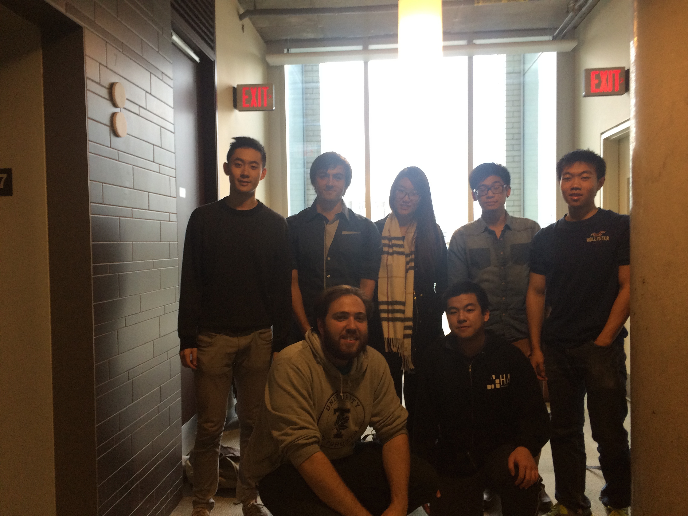

## Introducing the team

- Team picture
    
    
- Biography (Please add your bio down below)
  - g3aishih
  
  - **SunnyLi** - g3sunny
    - Sunny is a 3rd year compsci student studying in UTSG, he is very
      passionate about programming and like to code with perfection.
      He is knowledgeable with git revision control and he uses it to
      improve his software development process. During the summer, he
      worked at a start up and contributed to opensource projects.
  
  - **Timothy Lai** - c2laitim
    - Timothy is a 3rd year Compter Science student studying at the 
      University of Toronto, St. George Campus. Though he may lack in
      experience, he is willing to learn from his fellow group members
      and looks forward to working with the group as well as developing
      his own skills. 
  
  - **g3abby** - g3abby
    - As a student specializing in Computer Science in UTSG, Abby started her PEY after 3rd year, currently working as a full-time Test Automation Developer at Trapezegroup. She has plenty of experience in issue investigation and writing automated test scripts for regression test. Besides her knowledge in Quality Assurance and Agile Development Methodology, she is also attracted to UI/UX design, and being good at Photoshopping.
  
  - g3wu
    - Lawrence is a third year Computer Science student at UTSG specializing
      in Computer Systems. He is interested in full-stack web development,
      programming languages, data structures, and systems design and
      administration. He worked on MarkUs last summer and will be working at
      Yelp next summer. Lawrence's tools of choice are vim, git, tmux, and zsh.
  
  - c4almash
  
  - **AlexDar** - c4darmin
    - I'm a 4th year compsci student enrolled in UTSC but taking a semester
      at UTSG. I've worked part time as a web developer for almost two years
      and enjoy working on the UI/UX as much as the full software development
      cycle. A strength of mine is that I am highly motivated to work on 'real
      life' projects, meaning that the released result will be used publicly.
      The inverse of this is my weakness, where I may find it difficult to work
      on projects that will not be used by anyone upon completion.
